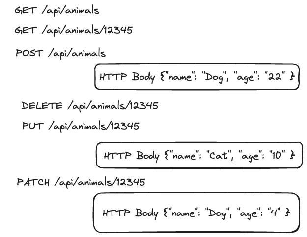

# REST with Express

## Client / Server


## RESTful APIs

- [What is REST?](https://en.wikipedia.org/wiki/REST)
- [Clean URLs](https://en.wikipedia.org/wiki/Clean_URL)

## HTTP Request Methods



[MDN Documentation](https://developer.mozilla.org/en-US/docs/Web/HTTP/Methods)

- GET: Retrieves data from the server. It's used to request resources.
- POST: Sends data to the server to create a new resource.
- PUT: Replaces an existing resource completelly with the provided data.
- PATCH: Updates an existing resource with partial data.

## HTTP Response Status Codes

[MDN Documentation](https://developer.mozilla.org/en-US/docs/Web/HTTP/Status) - You can find detailed list of all codes here.

## Project Setup

Start by creating a new folder and open it in VS Code.

You can create a simple Node.js server without `package.json`, but you'll need it to use Express. To generate `package.json`, run the command `npm init`. For more details, refer to the [npm init documentation](https://docs.npmjs.com/cli/v7/commands/npm-init).

Install Express by running:

```bash
npm i express
```

For more information, check the [Express documentation](https://www.npmjs.com/package/express).

Next, create a `server` folder, and inside it, a `src` folder. In `src`, create a file named `app.js`. The main file for servers is typically named `app.js`.

**Important:** Don’t forget to initialize Git using `git init`. Also, create a `.gitignore` file and add `node_modules` to it. This will ensure the `node_modules` folder is excluded from version control.

Your project structure should look like this:

```plaintext
.
└── server
    ├── package-lock.json
    ├── package.json
    └── src
```

Now, you can create your first Express server using this [basic template](https://expressjs.com/en/starter/hello-world.html):

```js
const express = require("express");
const app = express();
const port = 3000;

app.get("/", (req, res) => {
  res.send("Hello World!");
});

app.listen(port, () => {
  console.log(`Server is running on port ${port}`);
});
```

For development purposes, you can use `node app.js` to run your app manually after each change. However, this can become tedious, especially when making frequent updates. To simplify this, you can use `node --watch-path=src src/app.js`.

The command `node --watch-path=src` runs Node.js in **watch mode**, specifically monitoring the `src` directory for changes. It automatically restarts the server when any file in the `src` folder is modified, similar to how the `nodemon` package works.

To automate this further, you can add the command to the `scripts` section of your `package.json` file like this:

```json
  "scripts": {
    "dev": "node --watch-path=src src/app.js"
  }
```

Now, you can simply run `npm run dev` to start your server with automatic restarts.

There is so called middleware, a function that runs between receiving a request from the client and sending a response, that can help you controll which path have been called.

```js
app.use("/*", (req, res, next) => {
  console.debug(req.path);
  next();
});
```

## Note:

Instead of using Postman, you can test your routes with `curl`. For example, you can run the following in your terminal to test a specific route:

```bash
curl http://localhost:3000/test
```

In this example, `test` is the route you've defined in `app.js`. This is a quick and efficient way to see the response from your server without switching to a different tool like Postman.

## Link it to the Frontend

- Create a new React project using `npm create vite@latest` or use an existing one.

- Browsers have a security feature called CORS (Cross-Origin Resource Sharing), which prevents access to another domain without proper permission. We will discuss CORS later, but for now, you can configure Vite's development server to handle this automatically.

```js
export default defineConfig({
  plugins: [react()],
  server: {
    proxy: {
      "/api": {
        target: "http://localhost:3000",
        changeOrigin: true,
        secure: false,
      },
    },
  },
});
```

- Ensure your API routes in Express are prefixed with `/api`, for example, `api/users` or `api/products`.

```js
// server/src/app.js
app.get("/api/test", (req, res) => {
  console.debug("Hello from Node.js Express Server: ", req.path);
  res.status(200).send({ name: "Dog", age: 12 });
});
```

- Create an async function called `handleLoadData` and use the [fetch API](https://developer.mozilla.org/en-US/docs/Web/API/Fetch_API/Using_Fetch) to request data like this:

```js
// client/src/App.jsx
const response = await fetch("/api/test");
const json = await response.json();
```

- Add a button to your frontend and attach the `handleLoadData` function to its `onClick` event.

Now, you can make requests from your frontend to your Express server!

## Target file structure

```plain
.
├── client
│   ├── README.md
│   ├── eslint.config.js
│   ├── index.html
│   ├── package-lock.json
│   ├── package.json
│   ├── public
│   │   └── vite.svg
│   ├── src
│   │   ├── App.css
│   │   ├── App.jsx
│   │   ├── assets
│   │   ├── index.css
│   │   └── main.jsx
│   └── vite.config.js
└── server
    ├── package-lock.json
    ├── package.json
    └── src
        └── app.js
```

## Notes

Feel free to clone the demo with the following command:

```sh
npx degit git@github.com:taktsoft-campus-talents/delphine-express-api-demo.git
```

## Demo Repository

- https://github.com/taktsoft-campus-talents/delphine-express-api-demo

## Additional

```sh
# system setup
brew install redis
brew services start redis
```

```js
// server setup (server folder)
npm i redis

// server/src/app.js
const db = require("./KeyValueStore");

// ...

const jsonData = {
  name: "Dog",
  age: 12,
};

// ...

// sample function calls
await db.insertData("animals", jsonData);
const jsonData = await db.getData("animals");
await db.flushData();
```
